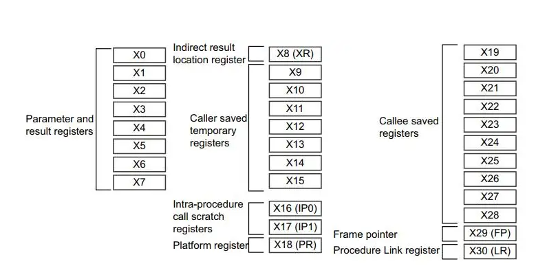
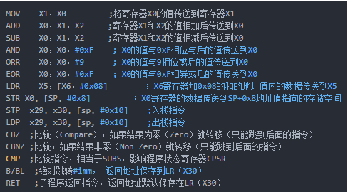
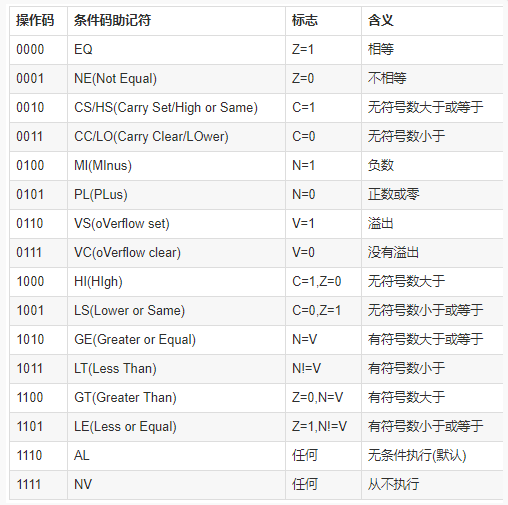
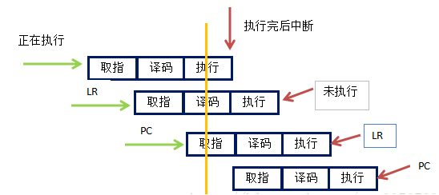

# ARM汇编语言

<!-- GFM-TOC -->

* 寄存器：ARM32和ARM64
    * [ARM32寄存器](#ARM32寄存器)
    * [ARM64寄存器](#ARM64寄存器的特点)
    
* 汇编指令：ARM32和ARM64
    * [ARM32汇编](#ARM32汇编指令)
    * [ARM64汇编](#ARM64汇编指令)

* ARM软中断
    * [Arm32软中断](#Arm32软中断)
	* [Arm64软中断](#Arm64软中断)
	
* ARM三级流水线
  
* [参考](#参考)
<!-- GFM-TOC -->

------

### ARM32寄存器


##### ARM32寄存器的特点?


32位arm的R0 - R7为低端寄存器（Thumb16模式下，只能使用R0-R7，R13,R14,R15这几个寄存器），这在所有ARM的工作模式下是共享的


参数寄存器：（R0-R3）

```
R0寄存器： 通常用于函数传参（参数1）或者普通寄存器或者函数返回值。
R1寄存器： 通常用于函数传参（参数2）或者普通寄存器。
R2寄存器： 通常用于函数传参（参数3）或者普通寄存器。
R3寄存器： 通常用于函数传参（参数4）或者普通寄存器。
```

特殊寄存器：

```
R7寄存器： 系统调用时，存放系统调用号，有时也用于作为FP使用。FP又叫frame pointer即栈基指针，主要在函数中保存当前函数的栈起始位置，用于堆栈回溯；
R13寄存器：R13又名SP，即栈指针寄存器，主要用于指向当前程序栈顶，配合指令pop/push等。栈主要用于存放局部变量，保存函数间调用的关键寄存器；
R14寄存器：R14又名LR，即链接寄存器，主要用于存放函数的返回地址，即当前函数返回时，知道自己该回到哪儿去继续运行，通常这个是和BL/BLX/CALL指令搭配；
R15寄存器：R15又名PC，即程序寄存器，主要用于存放CPU取指的地址，记住是取指地址，不是当前运行地址；
```

##### Arm32函数调用约定原理以及怎么判断参数个数？
函数调用约定：


```
arm32位调用约定采用ATPCS，参数1~参数4 分别保存到 R0~R3 寄存器中 ，剩下的参数从右往左一次入栈，被调用者实现栈平衡，返回值存放在 R0 中。第5个参数需要通过sp + 4 访问，第n个参数需要通过sp + 4*(n-4)访问
```

函数的传参和返回：

```
 arm32函数调用参数传递顺序是从r0~r3，第一个参数在r0中，第二个参数在r1中，依次类推。参数超过4个，则要先入栈，从第五个参数开始从栈中取。 程序返回值如果是32位 则用R0进行返回，为64位时则R0返回低位， R1返回高位
```

函数的参数个数判断：

```
例如 Arm32 我们需要看blx后面的值，是不是寄存器，若是，判断小不小于4，若小于，则参数个数即是
BLX Rn  n<4 则参数个数为0-n
若n>4  比如 BLX R12   首先我们可以确定一定有4个参数 R0-R3 然后我们需要观察上面STR指令并结合伪代码函数参数个数，来确定，一般多余的参数会使用STR来存入堆栈
```

##### Arm32和Thumb的区别？

32位下有两种模式arm模式和Thumb模式

```
A32模式（ARM instruction sets），指令固定的编码长度为32bit；
T32模式（Thumb instruction sets），指令可以编码成16bit长，也可编码成32bit长；
```

Arm32与Thumb的切换：

```
ARM32指令集与Thumb指令集切换方法，是在BX和BLX指令跳转时，判断目标地址最低位是否为1
如果为1，跳转时将CPSR寄存器标志T置位，并将目标地址处的代码解释位Thumb代码，处理器切换到Thumb状态；
如果为0，跳转时将CPSR寄存器标志T复位，并将目标地址处的代码解释位ARM32代码，处理器切换到ARM32状态。
```

Arm32与Thumb的区别：

```java
（1）条件执行：ARM状态下的所有指令都支持条件执行。某些ARM处理器版本允许使用IT指令在Thumb中进行条件执行。条件执行提高了代码密度，因为它减少了要执行的指令数量，并节省了昂贵的分支指令。
（2）32位ARM和Thumb指令：32位Thumb指令具有.w后缀。
（3）桶形移位器是另一种ARM模式特有的功能。它可以将多个指令合并成一个。例如，您可以通过使用如下指令（将移位包含在MOV指令内）左移1位“Mov R1，R0，LSL＃1; R1 = R0 * 2”从而代替两个乘法指令（只用乘法指令将寄存器的值乘以2，并使用MOV将结果存储到另一个寄存器中）。
要切换处理器的执行状态，必须满足以下两个条件之一：
（4）我们可以使用分支指令BX（分支和状态切换）或BLX（分支，返回和状态切换），并将目标寄存器的最低有效位置1。这可以通过将1添加到偏移量（如0x5530+1）来实现。你可能会认为这会导致对齐问题，因为指令总是2或4字节对齐的。然而，这么做不会导致问题，因为处理器在读取指令时是忽略最低有效位的。更多的细节将在第6篇：条件分支中介绍。
（5）如果当前程序状态寄存器中的T位置1，我们知道我们处于Thumb模式
```

### ARM64寄存器



##### ARM64寄存器的特点?

| 寄存器名称 | 用途                                                         |
| ---------- | ------------------------------------------------------------ |
| x0~x7      | 用于传递子程序的参数，使用时不需要保存，多余参数保存在调用者栈中，通过栈传递给被调用函数。其中x0寄存器还可以作为返回值寄存器使用。 |
| x8         | 间接结果寄存器，使用时不需要保存，一般用于传递间接结果的地址，比如函数返回一个大的结构体，x8保存结构体地址。 |
| x9~x15     | 临时寄存器，子程序使用时不需要保存。                         |
| x16~x17    | 又名IP0、IP1，内部过程调用寄存器，常用于动态链接中的plt寻址等指令。 |
| x18        | 平台预留寄存器，在不同的操作系统使用不一样。                 |
| x19~x28    | 临时寄存器，子程序使用时必须保存。                           |
| x29        | 帧指针寄存器（FP），用于连接栈帧，使用时必须保存。           |
| x30        | 链接寄存器（LR），用于保存子程序的返回地址。                 |

**在ARM64下，PC的值只能间接读取或改变——**

```
（1）64位可读取PC值的情况有：计算相对地址，如adr，adrp，文字池加载以及直接分支；子程序返回地址，比如bl，blr
（2）可修改pc的方式为：使用控制流指令，如条件跳转、无条件跳转、异常生成和异常返回指令
```

##### Arm64函数调用约定原理以及怎么判断参数个数？

函数调用约定：

```
arm64位调用约定采用AAPCS64。参数1~参数8 分别保存到 X0~X7 寄存器中 ，剩下的参数从右往左一次入栈，被调用者实现栈平衡，返回值存放在 X0 中。（第8个参数需要通过sp访问，第9个参数需要通过sp + 8 访问，第n个参数需要通过sp + 8*(n-8)访问）。
```

函数的传参和返回：

```
arm64函数调用参数传递顺序是X0~X7：用于函数入参，最多支持8个函数入参，多余采用入栈方式，X0：用于返回函数结果。
```

函数的参数个数判断：

同上

### ARM32汇编指令

寻址指令：

```
立即寻址：MOV R0,#123 R0=123
寄存器寻址：MOV R0,R1 R0=R1
寄存器移位寻址：MOV R0,R1,LSL #2 	R0=R1*4
寄存器间接寻址：LDR R0,[R1] 将R1寄存器中的值作为地址，取出地址中的值赋予R0
寄存器间接基址偏移寻址：LDR R0,[R1，#-4]将R1寄存器的值-0x4的值作为地址，取出地址中的值给R0
```

比较指令：

```
CMP：比较
CMP R0 #0 		R0寄存器中的值与0比较
标志位：如z位，这个都可以在动态调试时，寄存器窗口看到
```

逻辑运算指令：

```
与：AND
或：ORR
异或：EOR                                    
移位：实质是乘，除，类似于小数点移位，但相反。小数点左移，数变小；右移变大。
但逻辑移位，左移变大，右移变小，且按2的倍数进行，因为是2进制。
LSL：逻辑左移←
LSR：逻辑右移←
```

算数运算指令：

```
ADD,SUB,MUL,DIV 有符号，无符号运算；带进位运算
```

寄存器交互指令：

```
LDR与STR
LDR：从存储器中加载数据到寄存器 ← Load
LDR R8,[R9,#4] R8为待加载数据的寄存器，加载值为R9+0x4所指向的存储单元 R8=[R9+4]

STR：将寄存器的数据存储到存储器 → Store
STR R8,[R9,#4] 将R8寄存器的数据存储到R9+0x4指向的存储单元

LDM与STM
LDM：将存储器的数据加载到一个寄存器列表 →
LDM R0,｛R1-R3｝将R0指向的存储单元的数据依次加载到R1,R2,R3寄存器

STM：将一个寄存器列表的数据存储到指定的存储器  ←

PUSH与POP
PUSH:将寄存器值推入堆栈
POP：将堆栈值推出到寄存器

SWP：将寄存器与存储器之间的数据进行交换
SWP R1, R1 [R0] 将R1寄存器与R0指向的存储单元的内容进行交换
```

跳转指令：

```
B 无条件跳转
BL 带链接的无条件跳转
BX 带状态切换的无条件跳转
BLX 带链接和状态切换的无条件跳转  
B loc_地址
BEQ,BNE
带L是带连接跳转，带X是带状态的跳转  BLX指令从ARM指令集跳转到指令中所指定的目标地址，并将处理器的工作状态有ARM状态切换到Thumb状态
```

### ARM64汇编指令



相比于ARM32，ARM32中的LDM、STM、PUSH、POP指令，在ARM64中并不存在。取而代之的是LDP、STP指令。

ARM64栈处理指令：

由于在ARM64下，对于栈的操作都是要16个字节对齐的，所以都是双寄存器读写操作

```
STP：写入指令，将数据从两个寄存器中读出来, 写入到栈中
LDP：读取指令，将数据从栈中读取出来, 存到两个寄存器中
```

##### Arm指令条件？

ARM指令所有指令都是带有条件的，默认是AL即无条件执行，当指令带有默认条件时不需要明确写出。ARM指令包含4位的条件码列表如下：



### ARM软中断

##### Arm32软中断？

在使用软中断进行系统调时，系统调用号通过R7寄存器传递，用SWI指令产生软中断，实现从用户模式到管理模式的切换。例如，调用exit(0)的汇编代码如下：

```
MOV R0, #0  //参数0
MOv R7, #1  //系统功能号1为 exit
SWI #0  //执行 exit(0)
```

##### Arm64软中断？

在使用软中断进行系统调时，系统调用号通过x8寄存器传递，用svc指令产生软中断，实现从用户模式到管理模式的切换。例如：

```
mov x0, 123 // exit code
mov x8, 93  // sys_exit() is at index 93 in kernel functions table
svc #0  // generate kernel call sys_exit(123);
```

### ARM三级流水线？

ARM处理器使用流水线来增加处理器指令流的速度，这样可使几个操作同时进行，并使处理与存储器系统之间的操作更加流畅，连续

ARM三级流水线分为：

```
取指：从存储器装载一条指令
译码：识别将要被执行的指令
执行：处理指令并将结果写会寄存器
```

ARM正在执行第1条指令的同时对第2条指令进行译码，并将第3条指令从存储器中取出,所以，ARM7流水线只有在取第4条指令时，第1条指令才算完成执行。无论处理器处于何种状态，程序计数器R15(PC)总是指向“正在取指”的指令，即下图中的第三条指令。



- 在ARM32状态下，当前执行指令的地址通常是pc-8，而在Thumb状态下通常是pc-4。
- 在AARCH64状态下，当前执行指令的地址通常是pc。

### 参考

[ARM汇编基本指令](https://ayesawyer.github.io/2019/08/26/arm%E6%B1%87%E7%BC%96%E5%9F%BA%E6%9C%AC%E6%8C%87%E4%BB%A4/)
